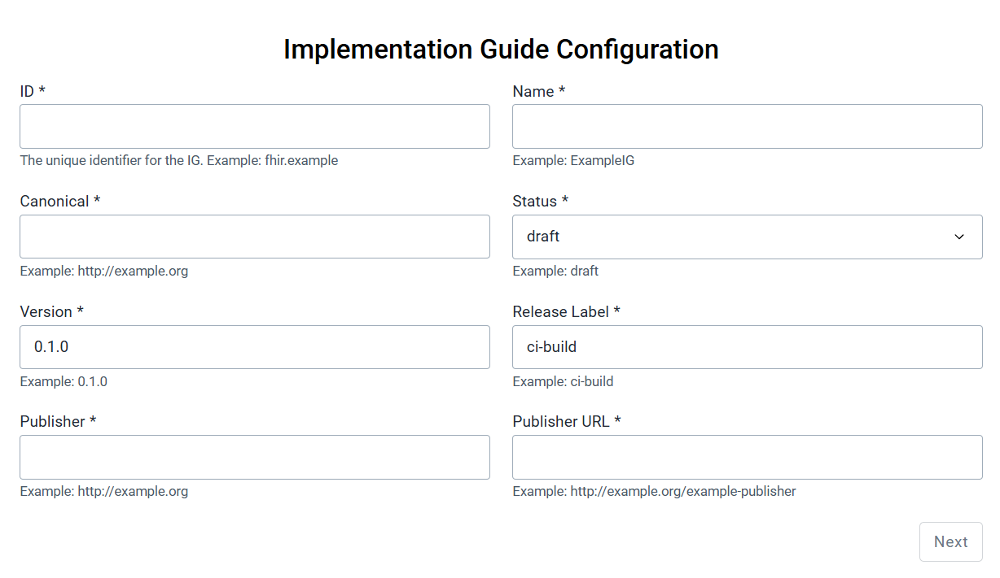
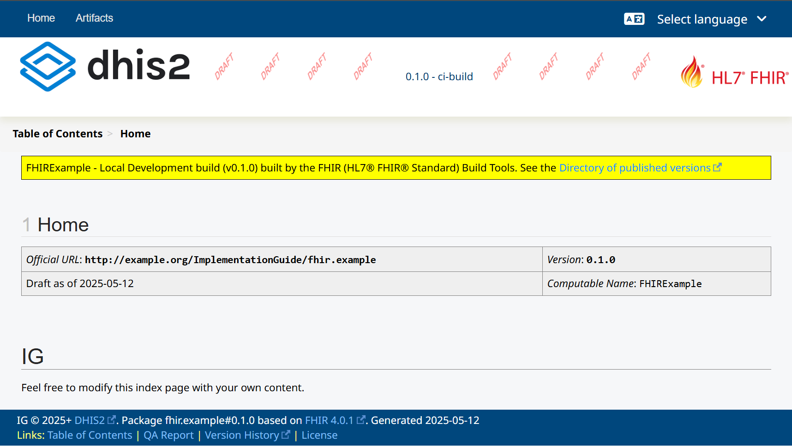

# DHIS2 Implementation Guide Generator App
## Introduction
### Overview
The DHIS2 Implementation Guide (IG) Generator App is desgined to help author FHIR IGs based on DHIS2 tracker metadata. The app automatically transform DHIS2 tracker program metadata into standardized FHIR Implementation Guides. The FHIR IG Generator bridges the gap between DHIS2's data model and FHIR's interoperability framework, enabling a documented entry point for further interoperability with FHIR conformant systems.

### What is an Implementation Guide (IG)?
An Implementation Guide (IG) is a structured document that provides detailed instructions on how to implement a specific use case using FHIR standards. It includes definitions of FHIR resources, profiles, extensions, and value sets, as well as examples and validation rules. By serving as a comprehensive rulebook for FHIR interoperability, an IG ensures that systems can exchange data consistently and reliably, providing a shared understanding of how information should be structured and communicated. For further information about IG authoring best practices, check out FHIR's [Guidance for FHIR IG Creation](https://build.fhir.org/ig/FHIR/ig-guidance/) and WHO's [SMART Guidelines Starter Kit](https://smart.who.int/ig-starter-kit/).


### Purpose
The primary goal of this app is to streamline and automate the process of documenting DHIS2 tracker programs as FHIR artifacts, reducing the complexity and effort involved in manual workflows. Specifically, the app:

- Maps DHIS2 tracker data structures to FHIR Logical Models, which represent the data elements, constraints, and relationships of DHIS2 tracker programs in a FHIR-compatible format.
- Uses FHIR Questionnaires to represent data capture forms, transforming program stages and their sections into structured questionnaires.
- Represents option sets as FHIR CodeSystems and ValueSets, where CodeSystems define standardized codes and ValueSets reference these codes for specific contexts.
- Validates DHIS2 metadata against FHIR constraints to identify and address inconsistencies or errors in the source data.
- Provides a foundation for interoperability by enabling DHIS2 metadata to be understood and used in FHIR-based systems, serving as a starting point for further integration and implementation.

### Target Audience
This app is primarily designed for DHIS2 implementers and Health Information Exchange (HIE) teams who need to document their tracker implementations or prepare for integration with FHIR-based systems. It is also a valuable tool for software developers working on system integrations and health informatics specialists analyzing and optimizing program structures.
### Current Scope and Limitations
It is important to understand that this tool currently serves primarily as a documentation tool and starting point for further FHIR work:

- The app generates generic FHIR logical models that represent DHIS2 structures rather than fully-conformant FHIR resources.
- These logical models serve as an important baseline for mapping to standard FHIR profiles (like `Patient` or `Observation`).
- For example, tracked entity attributes in the logical model would need to be mapped to appropriate elements in a FHIR `Patient` profile for complete interoperability.

As the tool evolves, more advanced mapping capabilities may be added, but its current value is in providing standardized documentation and a foundation for more specialized interoperability work.

## Using the App
### Prerequisites
Before using the app, ensure you have:
* A DHIS2 instance (version 2.39 or later) with configured tracker programs.
* Have the app installed on your DHIS2 Instance. (Available on the [App Hub](https://apps.dhis2.org/user/app/1928228f-edbe-461d-b805-8ed94aa582a3)).
* Basic familiarity with DHIS2 tracker programs and FHIR concepts.

### Step-by-Step Guide

#### 1. Configure Implementation Guide Settings


1. The first step is configuring the implementation guide metadata:
  * **ID**: Unique identifier for the IG (e.g., `dhis2.tb-program.ig`).
  * **Name**: Descriptive name for the IG.
  * **Canonical URL**: Base URL that uniquely identifies the IG.
  * **Status**: Publication status (draft, active, retired, or unknown).
  * **Version**: Following semantic versioning (e.g., `0.1.0`).
  * **Release Label**: Additional version information (e.g., `ci-build`).
  * **Publisher Information**: Details about the publishing organization.

2. Click "Next" after completing the configuration form.

#### 2. Select DHIS2 Tracker Programs


On the second screen:
* Browse available tracker programs from your DHIS2 instance.
* Select one or more programs to include in your IG.
* Use the filter to find specific programs if your system has many.
* Selected programs will appear on the right side.

#### 3. Generate and Download the IG

Once the user is satisfied with the selection and validation results:

1. Click "Download FHIR IG".
2. The app will transform the selected tracker programs into FHIR artifacts.
3. A ZIP file containing the complete IG bundle will be downloaded.
4. The app will display instructions for building the IG.

The downloaded bundle includes:
* FHIR Shorthand files (.fsh) representing all artifacts.
* Pre-configured IG Publisher settings.
* All necessary directory structures and configuration files.
* Scripts to run the IG Publisher tool.

## The Transformation Process

### DHIS2 to FHIR Mapping Principles
The transformation follows these general principles:

1. **Preservation of meaning**: DHIS2 concepts are mapped to FHIR equivalents that best preserve semantic meaning.
2. **Logical models first**: DHIS2 structures are represented as FHIR logical models before considering standard FHIR resources.
3. **Standard conformance**: Generated artifacts conform to established FHIR profiles where applicable.
4. **Documentation focus**: The primary goal is creating understandable documentation, not implementation-ready resources.

### Detailed Mapping Approach

The table below summarizes how DHIS2 metadata is mapped to FHIR artifacts, along with additional notes for each mapping:

| **DHIS2 Metadata**               | **FHIR Artifact**                          | **Notes**                                                                                     |
|----------------------------------|--------------------------------------------|-----------------------------------------------------------------------------------------------|
| **Tracker Programs**             | FHIR Logical Models                        | Captures program attributes, metadata, structure, and relationships.                         |
| **Program Stages**               | FHIR Logical Models, FHIR Questionnaires   | Logical Models capture data structure; Questionnaires represent data collection forms.       |
| **Program Stage Sections**       | FHIR Questionnaire Groups                  | Represented as groups of related questions in the questionnaire.                             |
| **Data Elements**                | FHIR Questionnaire Items, Logical Model Attributes | Mapped based on data type (e.g., TEXT → string, INTEGER → integer) and cardinality.          |
| **Option Sets**                  | FHIR CodeSystems, FHIR ValueSets           | CodeSystems define standardized codes; ValueSets reference CodeSystems for use in forms.     |
| **Tracked Entity Attributes**    | FHIR Logical Model Attributes              | Mapped with appropriate data types and cardinality.                                           |


1. **Tracker Programs → FHIR Logical Models**: Logical models are used to represent the overall structure of a tracker program, including its metadata and relationships.
2. **Program Stages → FHIR Questionnaires**: Questionnaires are designed to represent the data collection forms, with sections and data elements mapped to groups and questions, respectively.
3. **Option Sets → FHIR CodeSystems & ValueSets**: Option sets are transformed into CodeSystems for defining codes and ValueSets for referencing these codes in forms and models.
4. **Data Elements**: Data elements are mapped to FHIR attributes with appropriate data types and cardinality based on whether they are required or optional in DHIS2.
5. **Tracked Entity Attributes**: These are mapped to logical model attributes, ensuring semantic meaning is preserved.

## FHIR Profiles Compliance

The table below summarizes the compliance of the generated artifacts with established FHIR profiles and the required elements for each artifact type:

| **FHIR Artifact** | **Conforms To**                          | **Required Elements**                                                                 |
|--------------------|------------------------------------------|---------------------------------------------------------------------------------------|
| **CodeSystem**     | `ShareableCodeSystem` profile           | - `experimental` status flag                                                         |
|                    | `PublishableCodeSystem` profile (optional) | - `caseSensitive` specification                                                      |
|                    |                                          | - `version` information                                                              |
|                    |                                          | - Proper identifiers                                                                 |
| **ValueSet**       | `ShareableValueSet` profile             | - `experimental` status flag                                                         |
|                    | `PublishableValueSet` profile (optional) | - `version` information                                                              |
|                    |                                          | - Proper referencing to CodeSystems                                                  |

## Building and Publishing your IG
After using the IG Generator app, you will have a downloaded, zipped IG bundle. Follow the steps below to build the IG and view its contents:

### 1. **Unzip the Generated IG Bundle**
- Extract the downloaded ZIP file into a directory of your choice.

### 2. **Set Up Required Tools**
Ensure the following tools are installed and available in your environment:
- **[SUSHI](https://github.com/FHIR/sushi)**: For compiling FHIR Shorthand into FHIR definitions.
  ```bash
  npm install -g fsh-sushi
  ```
- **[Java JDK](https://www.oracle.com/java/technologies/downloads/)** (version 17 or higher): Required for running the IG Publisher.
- **[Ruby](https://www.ruby-lang.org/en/downloads/)** and **[Jekyll](https://jekyllrb.com/docs/installation/)**: Required for the IG Publisher.

### 3. **Run the IG Publisher**
The IG Publisher will generate the IG content, validate it, and create a browsable website.

#### **Steps:**
1. Open a terminal and navigate to the extracted IG directory.
   ```bash
   cd path/to/ig
   ```
2. Run the `_updatePublisher` script to download the latest version of the IG Publisher:
   - **Linux/macOS**:
     ```bash
     ./_updatePublisher.sh
     ```
   - **Windows**:
     ```cmd
     _updatePublisher.bat
     ```
3. Run the `_genonce` script to generate the IG content:
   - **Linux/macOS**:
     ```bash
     ./_genonce.sh
     ```
   - **Windows**:
     ```cmd
     _genonce.bat
     ```

### 4. **View the Generated IG**
1. Navigate to the `output` folder in the extracted IG directory.
2. Open the `index.html` file in a web browser.
3. Explore the IG, including the **Artifacts** tab, to view all generated FHIR artifacts.

For alternative ways of publishing an IG, including instructions on how to publish to Github pages, check out [How to Publish a FHIR Implementation Guide](https://build.fhir.org/ig/ElliotSilver/how-to-publish/).

## Navigating the Generated IG

Once the IG is built, you can explore its contents in a web browser. Below is a quick guide to the key pages:

### 1. Home Page
  

The home page provides an overview of the implementation guide, including its purpose, scope, and key details. It serves as the starting point for navigating the IG. Use the menu and the footer on the bottom of the page to access other sections, such as the table of contents and quality assurance report.

To modify the index page of your IG to add your own custom content, navigate to the `/input/pagecontent/index.html` page in your IG folder. 


### 2. Artifacts Page
  

The artifacts page lists all the FHIR resources generated by the app, such as Logical Models, CodeSystems, and ValueSets. Clicking on an artifact opens a detailed view, showing its structure, metadata, and references: 

  

This page is essential for reviewing the generated resources and ensuring they meet your requirements.

### 3. QA Page (`qa.html`)
  
The QA page provides an overview of quality assurance checks for the generated IG. It includes validation results, warnings, and detailed feedback on potential issues. Use this page to identify and address problems such as missing required fields, invalid configurations, or broken references. Additionally, the QA report highlights metadata inconsistencies in the source DHIS2 system, helping you pinpoint areas that require correction to ensure a valid and complete IG.

## Fixing Errors in Your Generated IG

When generating FHIR artifacts, metadata inconsistencies in the source DHIS2 tracker programs can lead to errors. Below are some common issues, their causes, and guidance on how to resolve them.

### Missing Option Set Codes
Option sets in DHIS2 must have unique codes for all options. Missing codes will result in errors when generating FHIR CodeSystems and ValueSets. To resolve this, update the option set codes through the DHIS2 Web API. Note that this cannot be done through the UI.

> **Important:** Changing option set codes affects all downstream logic that relies on those codes, including rules, indicators, and external integrations. Ensure you carefully assess the impact of any changes before proceeding.


### Trailing or Leading Spaces in Metadata
Trailing spaces in option set codes or names can cause validation errors. These issues often arise from typing errors in the source metadata. To fix this, remove trailing spaces using the DHIS2 Maintenance app or API.


### Reference Integrity Issues
Broken references between metadata elements, such as ValueSets and CodeSystems, can lead to invalid FHIR artifacts and errors during validation. These issues often arise from inconsistencies in the source metadata or misconfigurations in the IG.

To resolve these issues:

- Review the source metadata and ensure that all references between metadata elements in DHIS2 are valid. For example, verify that data elements referencing an option set have a valid optionSet ID.
- If the source metadata cannot be updated, review the generated FSH files and fix any broken references manually.
- References might break due to invalid IG configuration parameters. Open the `sushi-config.yaml` file in the root IG folder and verify that all configuration settings, such as `canonical` URLs and resource paths, are correct.
>**Tip:** Always document any manual changes made to the FSH files or configuration to ensure transparency and reproducibility.


### General Validation Errors
Validation errors may occur due to missing required fields or invalid configurations in the generated artifacts. Review the validation logs provided by the IG Publisher or SUSHI to identify the issues. Correct the errors in the FSH files and document any changes made.


### Key Considerations
- Always resolve metadata issues directly in the DHIS2 instance whenever possible to ensure consistency and avoid manual corrections in the generated artifacts.
- Use the DHIS2 Web API for complex changes, such as updating option set codes. Be cautious and document all changes thoroughly.
- Verify that all option set names and codes are unique across the DHIS2 instance to prevent conflicts during IG generation.

---

This project was bootstrapped with [DHIS2 Application Platform](https://github.com/dhis2/app-platform).

## Available Scripts

In the project directory, you can run:

### `yarn start`

Runs the app in the development mode.<br />
Open [http://localhost:3000](http://localhost:3000) to view it in the browser.

The page will reload if you make edits.<br />
You will also see any lint errors in the console.

### `yarn test`

Launches the test runner and runs all available tests found in `/src`.<br />

See the section about [running tests](https://platform.dhis2.nu/#/scripts/test) for more information.

### `yarn build`

Builds the app for production to the `build` folder.<br />
It correctly bundles React in production mode and optimizes the build for the best performance.

The build is minified and the filenames include the hashes.<br />
A deployable `.zip` file can be found in `build/bundle`!

See the section about [building](https://platform.dhis2.nu/#/scripts/build) for more information.

### `yarn deploy`

Deploys the built app in the `build` folder to a running DHIS2 instance.<br />
This command will prompt you to enter a server URL as well as the username and password of a DHIS2 user with the App Management authority.<br/>
You must run `yarn build` before running `yarn deploy`.<br />

See the section about [deploying](https://platform.dhis2.nu/#/scripts/deploy) for more information.

## Learn More

You can learn more about the platform in the [DHIS2 Application Platform Documentation](https://platform.dhis2.nu/).

You can learn more about the runtime in the [DHIS2 Application Runtime Documentation](https://runtime.dhis2.nu/).

To learn React, check out the [React documentation](https://reactjs.org/).