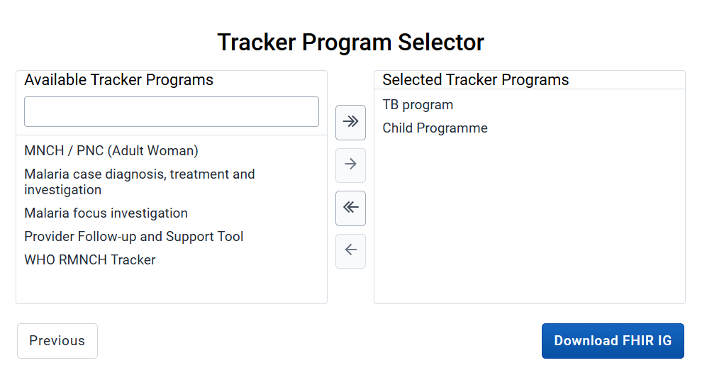

## DHIS2 Implementation Guide Generator App
The IG Generator app enables users to create FHIR Implementation Guides (IGs) based on DHIS2 tracker program metadata. The app allows users to set the configuration of an IG, select tracker programs, and transform the DHIS2 tracker metadata into FHIR artifacts. The app generates a local IG bundle, ready to be built with external tools like [SUSHI](https://github.com/FHIR/sushi). A DHIS2 instance with tracker metadata is required, and the app is designed as a tool to simplify IG authoring.



## Building the Generated Implementation Guide (IG)

After using the IG Generator app, you will have a downloaded, zipped IG bundle. Follow the steps below to build the IG and view its contents:

### 1. **Unzip the Generated IG Bundle**
- Extract the downloaded ZIP file into a directory of your choice.

### 2. **Set Up Required Tools**
Ensure the following tools are installed and available in your environment:
- **[SUSHI](https://github.com/FHIR/sushi)**: For compiling FHIR Shorthand into FHIR definitions.
  ```bash
  npm install -g fsh-sushi
  ```
- **[Java JDK](https://www.oracle.com/java/technologies/downloads/)** (version 17 or higher): Required for running the IG Publisher.
- **[Ruby](https://www.ruby-lang.org/en/downloads/)** and **[Jekyll](https://jekyllrb.com/docs/installation/)**: Required for the IG Publisher.

### 3. **Run the IG Publisher**
The IG Publisher will generate the IG content, validate it, and create a browsable website.

#### **Steps:**
1. Open a terminal and navigate to the extracted IG directory.
   ```bash
   cd path/to/ig
   ```
2. Run the `_updatePublisher` script to download the latest version of the IG Publisher:
   - **Linux/macOS**:
     ```bash
     ./_updatePublisher.sh
     ```
   - **Windows**:
     ```cmd
     _updatePublisher.bat
     ```
3. Run the `_genonce` script to generate the IG content:
   - **Linux/macOS**:
     ```bash
     ./_genonce.sh
     ```
   - **Windows**:
     ```cmd
     _genonce.bat
     ```

### 4. **View the Generated IG**
1. Navigate to the `output` folder in the extracted IG directory.
2. Open the `index.html` file in a web browser.
3. Explore the IG, including the **Artifacts** tab, to view all generated FHIR artifacts.

---

This project was bootstrapped with [DHIS2 Application Platform](https://github.com/dhis2/app-platform).

## Available Scripts

In the project directory, you can run:

### `yarn start`

Runs the app in the development mode.<br />
Open [http://localhost:3000](http://localhost:3000) to view it in the browser.

The page will reload if you make edits.<br />
You will also see any lint errors in the console.

### `yarn test`

Launches the test runner and runs all available tests found in `/src`.<br />

See the section about [running tests](https://platform.dhis2.nu/#/scripts/test) for more information.

### `yarn build`

Builds the app for production to the `build` folder.<br />
It correctly bundles React in production mode and optimizes the build for the best performance.

The build is minified and the filenames include the hashes.<br />
A deployable `.zip` file can be found in `build/bundle`!

See the section about [building](https://platform.dhis2.nu/#/scripts/build) for more information.

### `yarn deploy`

Deploys the built app in the `build` folder to a running DHIS2 instance.<br />
This command will prompt you to enter a server URL as well as the username and password of a DHIS2 user with the App Management authority.<br/>
You must run `yarn build` before running `yarn deploy`.<br />

See the section about [deploying](https://platform.dhis2.nu/#/scripts/deploy) for more information.

## Learn More

You can learn more about the platform in the [DHIS2 Application Platform Documentation](https://platform.dhis2.nu/).

You can learn more about the runtime in the [DHIS2 Application Runtime Documentation](https://runtime.dhis2.nu/).

To learn React, check out the [React documentation](https://reactjs.org/).
